# __GitLab to Github Mirroring Repository__

## Project Objective
This project demonstrates how to automatically mirror a GitLab repository to GitHub so that any changes pushed to GitLab are also synced to GitHub.

Repository mirroring automatically synchronizes commits, branches, and tags between repositories

## Architecture Diagram:

## Technologies Used:
* Git
* Gitlab
* Github
* HTML (for testing sync)

### Step 1 - Create a Github Repository 
Create a ew repository in GitHub and initilize it with README

1. Go to Github
2. Click New Repository
3. Enter repository name

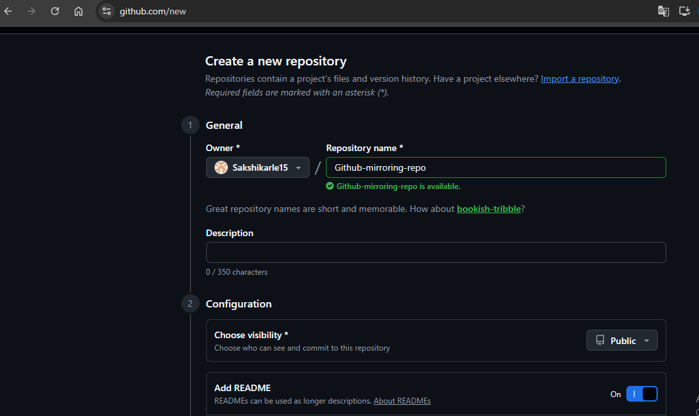

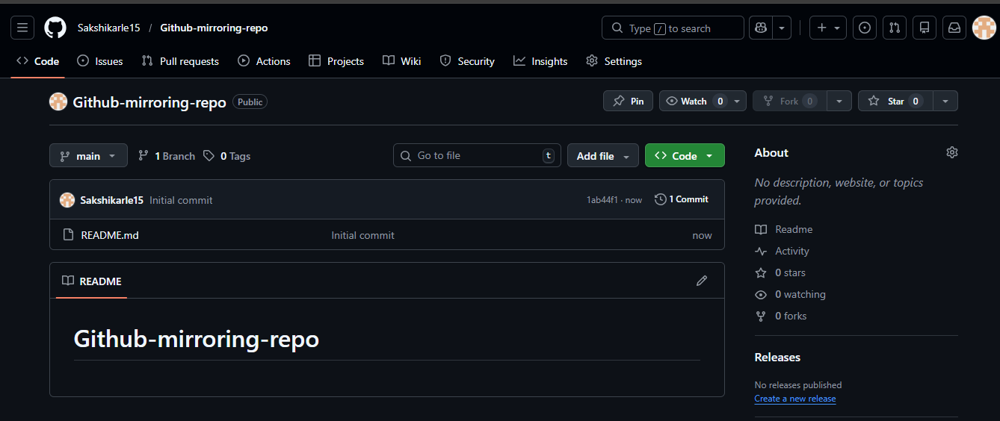

### Step 2 - Create GitLab Repository

1. Login to GitLab
2. Click New Project
3. Choose Blank Project

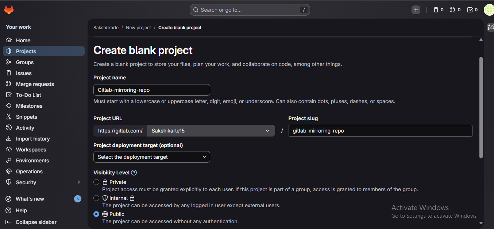
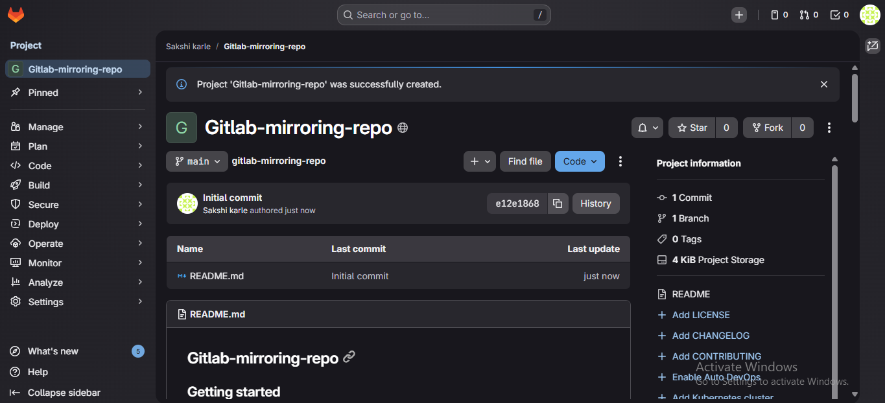

### Step 3 - Generate GitHub Personal Access Token (Classic)

Go to:

GitHub -> Settings -> Developer Settings -> Personal Access Tokens-> Tokens(Classic) -> Generate New Token

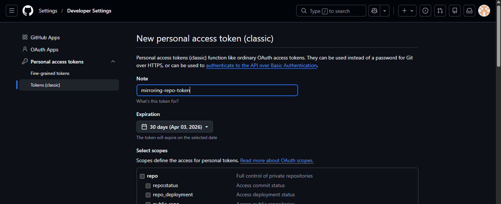

Grant required permissions (repo access recommended)

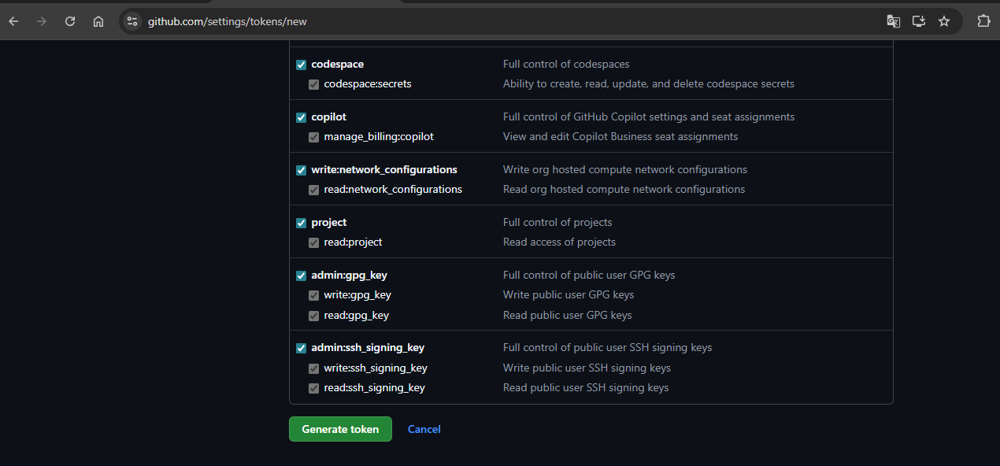
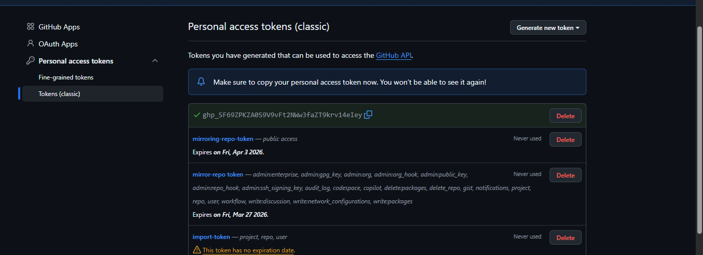

After generating the token, copy it immediately. you will use it as a password in GitLab mirror configuration.

### Step 4 - Configure GitLab Push Mirroring

Now configure GitLab to push the repository to GitHub.

1. Open your GitLab repository
2. Go to
project -> Settings -> Repository -> Mirroring Repositories

Click **Mirror Repository**

Use this format for Git repository URL: https://<Github_username>@github.com/<GITHUB_USERNAME>/<GITHUB_REPO>.git

GitLab supports push mirroring where commits pushed to GitLab are automatically sent to the remote repository.

## Step 5: Use GitHub Token as Password

When prompted for password:

* Username -> your GitHub username
* Password -> Paste GitHub Personal Access Token

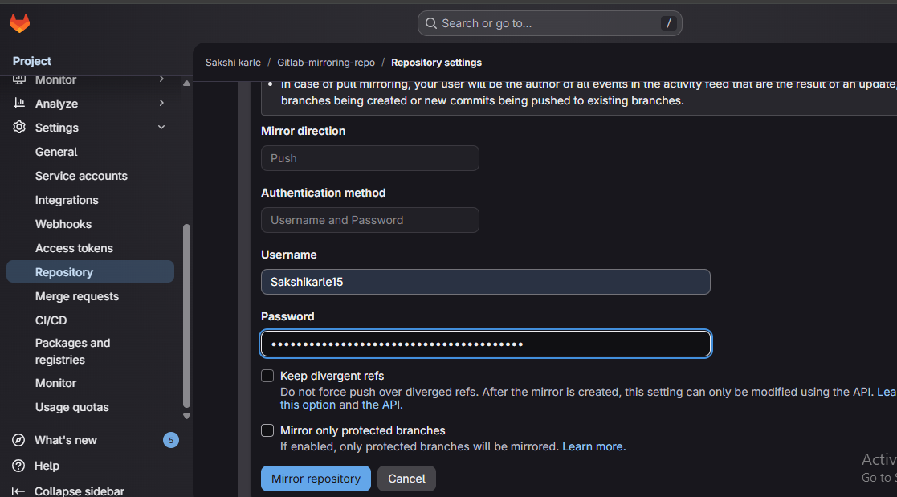

Click **Mirror repository** to complete setup

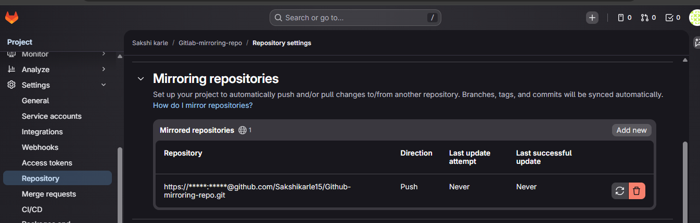

## Step 6: Clone GitLab Repository & Push Code

Clone Repository:

    git clone https://gitlab.com/<GITLAB_USERNAME>/<GITLAB_REPO>.git

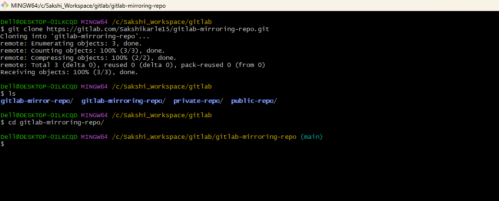

Create and push a file:

      added index.html

Add content:

     <h1>This is my mirror repo project</h1>

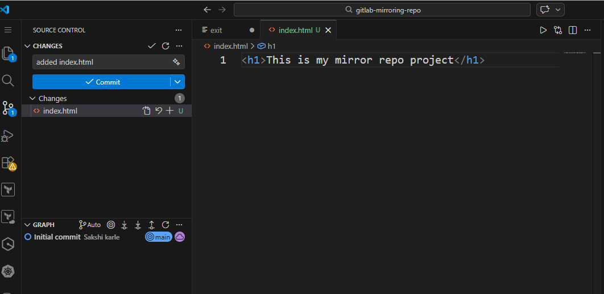

Commit and Push:

     git add index.html
     git commit -m "index.html file added"
     git push -u origin main

## Output Verification

1. File in GitLab Repository
   
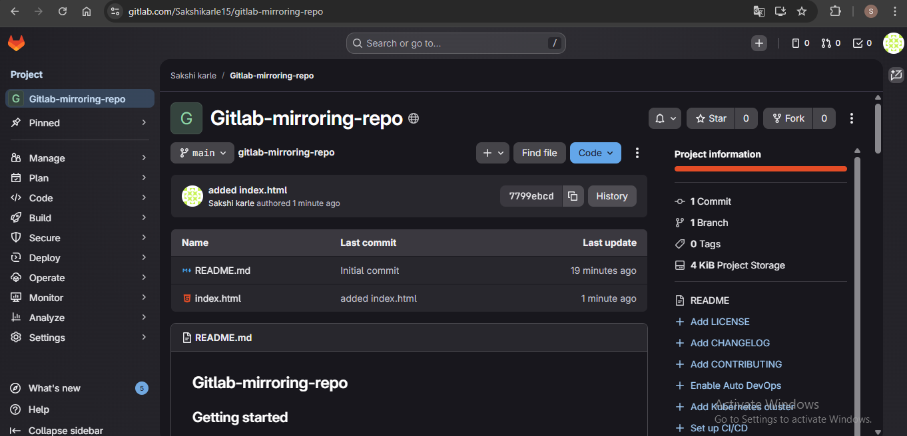

2. Add Any one File and push on GitLab
   

3. Done Sucessfully (Mirrored to GitHub)

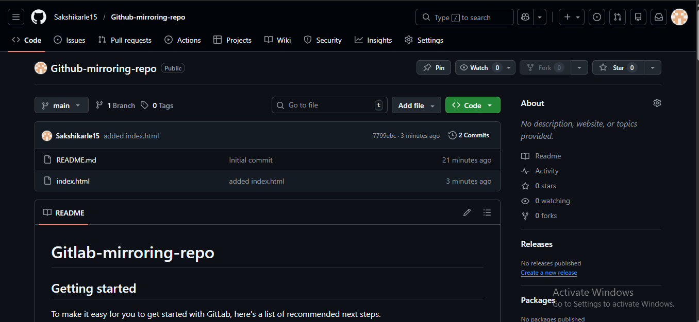

Now the same file will automatically appear in your GitHub repository because of push mirroring.

## Conclusion
This project successfully demonstrates how to configure automated push mirroring between GitLab and GitHub. here changes pushed to the GitLab repository are automatically synchronized to the GitHub repository.

By implementing GitLab Push Mirroring:

* Every commit pushed to GitLab is automatically synchronized with GitHub
* Repository backup and redundancy are ensured
* Cross-platform collaboration becomes seamless
* Manual duplication of code is eliminated
* Workflow becomes automated, secure, and efficient
